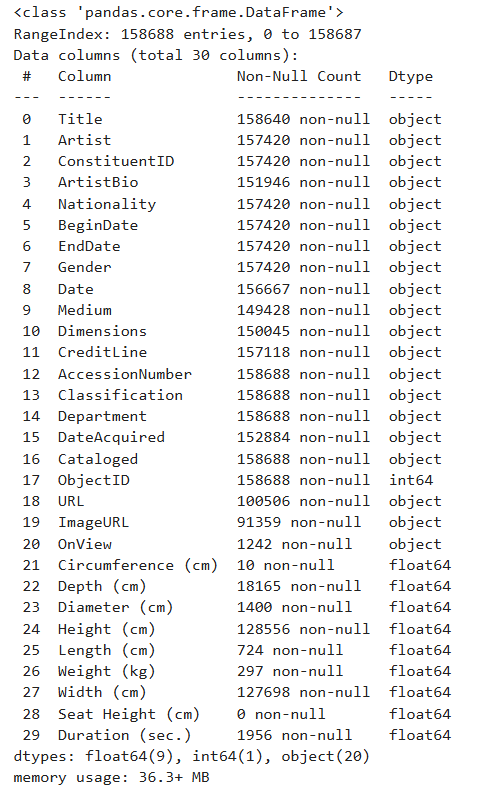
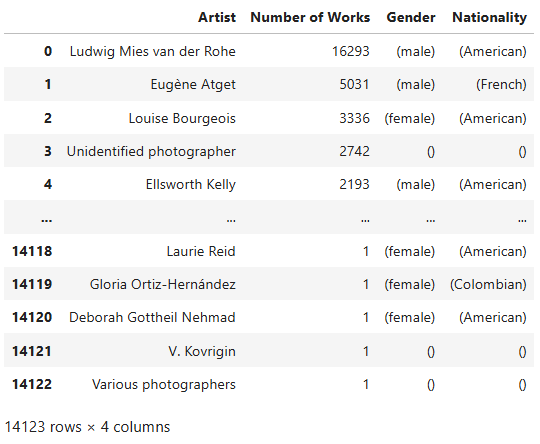
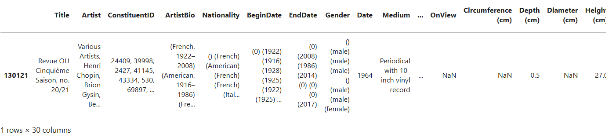
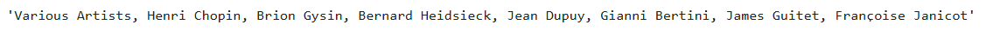
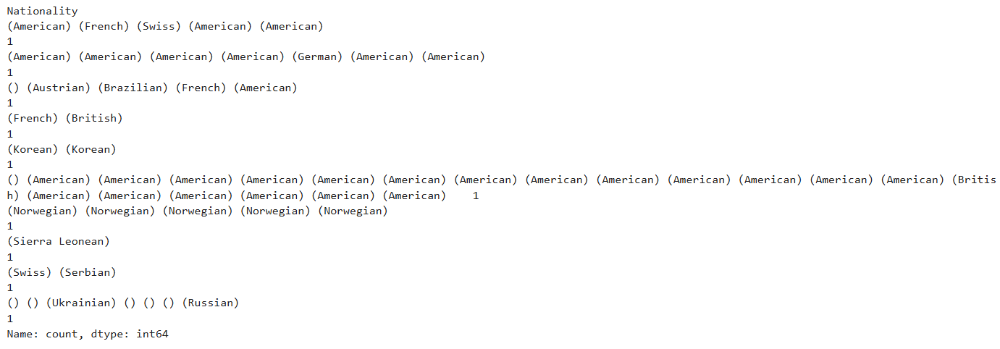

:::::::::::::::::::::::::::::::::::::: questions 

- What quantitative analysis operations can be performed on tabular data?
- How can these operations be translated into Python code?

::::::::::::::::::::::::::::::::::::::::::::::::

::::::::::::::::::::::::::::::::::::: objectives

- Learn how to initiate the analysis of tabular data
- Understand which aspects of a tabular dataset can be analyzed quantitatively
- Learn to break down the analysis into smaller tasks, think in terms of computer logic 
by writing pseudocode, and translate these tasks into code
- Learn using the Python library Pandas for analyzing tabular data
- Learn using the Python library Plotly for visualizing tabular data

::::::::::::::::::::::::::::::::::::::::::::::::

Let’s take on the role of an art historian in this chapter and analyze the MoMA dataset 
introduced in the **Summary and Setup** section. We’ll assume that we are completely 
unfamiliar with the dataset, its contents, structure, or potential usefulness for our 
research. The first step would be to look at this dataset and get familiar with its 
shape, dimension and different aspects. This initial stage of investigation is known 
as [exploratory data analysis](https://www.geeksforgeeks.org/what-is-exploratory-data-analysis/).

To begin, we first need to open an IDE (Integrated Development Environment), select the 
programming language we’ll use, and load the dataset into the environment to start 
working with it. In this case, we’ll be using Jupyter Notebook as our IDE and Python 
as our programming language.

## Step 1 - Importing the Necessary Python Libraries

Modern computers operate using only ones and zeros — binary code. These binary digits can 
be combined to represent letters, numbers, images, and all other forms of data. At the 
most fundamental level, this is the only type of information a computer can process.

However, when you're writing code to analyze data or build applications, you don’t want 
to start from scratch — managing raw binary data or even working solely with basic characters 
and numbers. That would be extremely time-consuming and complex. Fortunately, others 
have already done much of this foundational work for us. Over the years, developers have 
created collections of pre-written code that simplify programming. You can think of these 
collections as toolboxes containing *functions* and *methods* that perform complex tasks with 
just a line or two of code. In Python, these toolboxes are called *libraries*.

:::::::::::::::::::::::::::::::::::::::::: spoiler
### What are Python functions and methods?

A **function** is a reusable block of code that performs a specific task. You write it 
once and can use it multiple times. Think of it like a kitchen recipe: you follow the 
same steps every time you want to bake a cake. Functions help make your code cleaner, 
shorter, and easier to manage.

A **method** is just like a function, but it "belongs" to something — usually an object 
like a string, list, or number. You use methods to perform actions on those objects.

An **argument** is a value you give to a function or method so it can do its job using 
that value.

When you define a function, you can set it up to accept input values. These inputs are 
called **parameters**. When you actually call the function and give it real values, 
those are called arguments. For example, in the following code, I am defining a function
called `greet`. The function takes the name of a person and says hello to 
that person. Here, `name` is a parameter, whereas `Basma` is an argument: 

``` Python
def greet(name):
    print("Hello, " + name)

greet("Basma")
```

::::::::::::::::::::::::::::::::::::::::::::::::::

Some Python libraries come built into the language, while others must be installed separately. 
Most external libraries can be easily installed via the [terminal](https://swcarpentry.github.io/shell-novice/) 
using a tool called `pip`.

Many Python libraries have quirky or creative names — part of the fun and culture of the 
programming world! For example, there's a library called `BeautifulSoup` for working with 
web data, and another called `pandas` for data analysis. Sometimes the name hints at the 
library's purpose, and sometimes it doesn’t — but you’ll get used to them over time. 
As you gain experience, you'll learn what each library is for, the tools it provides, 
and when to use them.

To use a library in your code, you first need to ensure it is installed on your computer. 
Then, you must import it into your script. If the library's name is long or cumbersome, 
you can assign it a shorter alias when importing it. For instance, in the example below, 
the `pandas` library is imported and abbreviated as `pd`. While you're free to choose any 
abbreviation, many libraries have common conventions that help make your code more readable 
to other programmers. In the case of `pandas`, `pd` is the widely recognized standard.

```Python
import pandas as pd
```

## Step 2 - Loading the Data into Your Code

### Understand the data type

The MoMA dataset we will be working with is stored in a `.csv` file. Go ahead and download it 
from the link provided in the **Summary and Setup** section. 

CSV stands for "comma-separated values". When you double-click to open the file, the name 
makes perfect sense: it contains information arranged in rows, with each value in a row 
separated by a comma. Essentially, it’s a way to represent a table using a simple text file.

Each line in a CSV file corresponds to a row in the table, and each comma-separated value 
on that line represents a cell in the row. The first line often contains headers — the 
names of the columns — which describe what kind of data is stored in each column. For 
instance, a CSV file containing student information might include headers like "Name", "Age", "Grade", and "Email".

Because CSV files are plain text, they’re easy to create and read using basic tools 
like text editors or spreadsheet programs. They’re also widely supported by programming 
languages and data analysis tools, making them a popular and convenient format for storing 
and exchanging tabular data.

The data you want to analyze is typically stored either locally on your computer or hosted 
online. Regardless of where it’s located, the first step in working with it is to load it 
into your code so you can analyze or manipulate it. 

### Store the data in a variable

When you load data into your code, you should store it in a *variable*. A variable functions 
like a container that can contain any type of data that you think of. For example, I can 
create a variable called `a_number` and store a number in it, like this:

``` Python
a_number = 12
a_number
```

I can also store a string (a sequence of characters, including letters, numbers, and 
other symbols) in a variable, which I'll call `a_string`, like this:"

``` Python
a_string= "This is a string, consisting of numbers (like 13), letters and other signs!"
a_string
```
Notice that you should put the value of the string inside double or single quotes, but you 
shouldn't do it for numbers. 

:::::::::::::::: caution
#### When naming a variable, note that:

- Only letters (a-z, A-Z), digits (0-9), and underscores (_) are allowed.
- The name cannot start with a digit.
- No spaces or special characters (like !, @, #, etc.) are allowed.
- Variable names are case-sensitive. For example, `myvar` and `MyVar` are two different variables.
- You cannot use Python reserved keywords like: `if`, `else`, `for`, `class`, `return`, etc. as variable names. 

::::::::::::::::::

You can either assign a value to a variable directly in your code, as you just did, or you can
load data that already exists on your computer or online, and store it in the variable. This is
what we are going to do right now:

``` Python
data_path= 'https://raw.githubusercontent.com/HERMES-DKZ/Python_101_humanities/main/episodes/data/moma_artworks.csv'
```

You already know that CSV files actually represent tabular data. To make our `.csv` file look 
like a table and become more readable and easier to work with, we are going to load it into a 
*DataFrame*.

DataFrames are powerful table-like data structures that can be created and manipulated using the `pandas` 
library, which we have previously imported into our code. A DataFrame organizes data into 
rows and columns, similar to a spreadsheet or database table. Each column in a DataFrame has 
a name (often taken from the header row of the CSV file), and each row represents an individual 
record or observation.

DataFrames are especially useful because they allow us to apply powerful functions and methods 
that simplify working with structured data. Whether you're analyzing trends, generating summaries, 
or preparing data for visualization, DataFrames provide a convenient and flexible way to manage your data.

In the following code snippet, we use the `read_csv()` function from `pandas` to load the 
contents of the CSV file into a DataFrame. This function reads the file and automatically turns it into a DataFrame. 
In this example, I am passing only one argument to the `read_csv()` function: the address 
of the `.csv` file that I want to load. I have already saved this address in the variable `data_path`. 
`moma_df` is the variable where we store the resulting DataFrame. Once the data is in a DataFrame, 
we can easily explore it, filter rows, select specific columns, clean the data, and perform 
many types of analysis.

``` Python
moma_df= pd.read_csv(data_path)
moma_df
```


As you can see, this is a large DataFrame, containing 158,688 rows and 30 columns. For now, 
we’re only interested in viewing the first few rows to get a quick overview of its structure — 
specifically the column names and the types of values stored in each column. To do this, we’ll 
use the DataFrame’s `.head()` method, like so:

``` Python
moma_df.head()
```


`.head()` is a method, which means it's a type of function that's associated with a specific 
object — in this case, a DataFrame. Like regular functions, methods can accept arguments 
placed within the parentheses that follow them. If you don’t provide one, `.head()` will return 
the first five rows by default. If you pass a number (e.g., `moma_df.head(2)`), it will return 
that many rows from the top of the DataFrame.

:::::::::::::::: callout
#### Writing pseudocode

By now, you can see that writing code follows a clear and logical workflow. As a beginner, 
it's good practice to start by writing pseudocode — a rough outline of your steps in plain, 
natural language — before translating it into actual code. This helps you plan your approach 
and stay focused on the logic behind each step.

For example, the steps we’ve taken so far might look like this in pseudocode:

``` 
- Import the necessary libraries.
- Save the file path where the data is stored in a variable.
- Load the data into the program from that path.
- Convert the data into a table format that’s easier to explore.
- Display only the first few rows of the table to avoid overwhelming output.
```

This pseudocode translates into the following Python code, which brings together all 
the lines we've written so far:

``` Python
import pandas as pd

data_path= 'https://raw.githubusercontent.com/HERMES-DKZ/Python_101_humanities/main/episodes/data/moma_artworks.csv'
moma_df= pd.read_csv(data_path)
moma_df.head()
```
::::::::::::::::::

This dataset contains several aspects that can contribute to research in art history. 
We will perform three distinct processes — **counting**, **searching**, and **visualizing** — 
which, as mentioned earlier, could potentially aid in quantitative humanities research. 
After completing each step, we will analyze the results and discuss whether they provide 
meaningful insights for scientific research or if they lack scientific significance.


## Step 3 - Counting and Searching

You can count all or a selected group of data points in a DataFrame. To start, let's get 
an overview of the counts and data types present in the DataFrame. To do this, we’ll use 
the `.info()` method on the DataFrame:

``` Python
moma_df.info()
```



This method provides valuable information about the DataFrame in a tabular format. 

:::::::::::::::: discussion
#### Insights from the `.info()` Method

- In the first column of the resulting table, you can see the names and numbers of all the columns 
in the DataFrame. As shown here, the first column, "Title", is numbered as "0". REMEMBER: 
In Python, indexing and counting always start from zero. This concept is important to keep 
in mind when working with lists, strings, Series, DataFrames, dictionaries, and other 
data structures.

- The second column in the table displays the number of "non-null" (non-empty) values in each 
DataFrame column. If you refer back to the first five rows of the DataFrame, you’ll notice 
that "NaN" appears quite frequently. "NaN" stands for "Not a Number" and is a special value 
used to represent missing, undefined, or unrepresentable numerical data.

<div style="margin-left: 30px;">

When preparing datasets, like the one from MoMA, it’s crucial for people working at GLAM 
(Galleries, Libraries, Archives, Museums) institutions not to leave any cells empty. If left 
blank, users may mistakenly believe that the value was simply forgotten. By using "NaN", the data 
preparers are indicating that they have no information about a particular data point. For example, 
when "NaN" appears under the "Circumference" column of an artwork, it means there is no available 
measurement for the artwork’s circumference.

Some providers of DataSets use other values instead of "NaN" to imply a missing value, such as: 

|Situation |Missing Value |
|--- |--- |
|Numeric data |NaN or None |
|Text data |None or "Unknown" |
|Database tables |NULL |
|External systems (e.g. Excel) |"N/A", #N/A, blank |

Returning to the DataFrame info, "non-null" values refer to values that are not NaN, NULL, N/A, 
or their equivalents. In other words, these are the useful values that contain meaningful information.

</div>

- The third column in the info table shows the data type of the values in each column. A data type 
tells Python (or, in this case, pandas) what kind of value something is, so it knows how to handle it. 
In this dataset, we have three main data types: "object", "int64", and "float64".

  - "int" stands for integer — whole numbers without decimals (e.g., 1, 2, 3, ...). The "64" in "int64" 
refers to the number of bits used to store the integer in memory: 64 bits. Larger sizes allow for the 
storage of larger numbers more accurately.
  - "float" stands for floating-point numbers (or decimal numbers), such as 1.345, 12.34878, or -0.1. 
Similarly, "64" in "float64" indicates the size of the number in memory, using 64 bits to 
store each decimal.

- Finally, in `pandas`, anything that isn't clearly a number is categorized as an "object". Examples 
of objects in pandas include:

  - Strings (text): "apple", "John", "abc123"
  - Lists with mixed values: ["hello", 3, None]
  - Python objects

::::::::::::::::::

The `.info()` method has already provided us with valuable insights into the data types in `moma_df` 
and how they should be handled during analysis. It has also performed some counting for us. 
Now, we can begin counting more specific elements within this DataFrame. For example, we can identify 
all the artist names in the DataFrame and determine how many works by each artist are included in 
MoMA's collection.

::::::::::::::::::::::::::::::::::::: challenge

How do you think we should proceed? Can you break down this task into single steps and write the 
pseudocode for each step?

:::: hint
We need to create a new DataFrame based on `moma_df` regarding the task at hand. 
This new DataFrame should contain two columns: the artist names and number of times each name
appears in `moma_df`.
::::

:::: solution
The pseudocode for this task looks something like this:

```
- Look at the column "Artist" in moma_df and find individual artist names. 
- Count the number of times each individual artist name appears in moma_df.
- Store the artist names and the number of their mentions in a new DataFrame called artist_counts.
```

::::
:::::::::::::::::::::::::::::::::::::::::::::::::

Let's translate the pseudocode into Python code: 

``` Python
artist_counts = moma_df['Artist'].value_counts().reset_index()
artist_counts.columns = ['Artist', 'Number of Works']
artist_counts
```


::::::::::::::::::::::::::::::::::::::: discussion
#### Let's analyze the code line by line

```
artist_counts = moma_df['Artist'].value_counts().reset_index()
```

When you use the `.value_counts()` method in `pandas`, it returns a Series where:

- The index consists of the unique values from the original column in `moma_df` (in this case, 
from the "Artist" column).
- The values represent how many times each artist appears in that column.

While this format is informative, it's not as flexible for further analysis because it's 
not a DataFrame with named columns. By adding `.reset_index()`, you're instructing pandas to 
convert the index (artist names) into a regular column. Afterwards, we rename the columns like this:

``` 
artist_counts.columns = ['Artist', 'Number of Works']
```

Here, we're assigning a list of two strings to rename the columns appropriately.
:::::::::::::::::::::::::::::::::::::::::::::::::::


Now that we've created the `artist_counts` DataFrame, we can perform statistical operations 
on it. While such statistical insights may not be significant for scholarly research in art history — 
since MoMA’s collection does not comprehensively represent global or regional art histories — 
they do shed light on the scope and patterns of MoMA’s collection practices.

To deepen our statistical analysis, it would be helpful to have additional information 
about the artists — such as their nationality and gender. Let's create a new DataFrame 
that includes these details and name it `artist_info`.

::::::::::::::::::::::::::::::::::::: challenge

Can you break down this task into single steps and write the pseudocode for each step?

:::: hint
In the new DataFrame, we need more information than just "Artist" and "Number of Works". 
We also need "Gender" and "Nationality" for this task. 
::::

:::: solution
Here's the pseudocode for solving this challenge:

- Extract a new DataFrame from `moma_df` that includes only the artist names, their gender, 
and nationality.
- Create another DataFrame from `moma_df` that includes artist names along with the count 
of how many times each artist appears.
- Merge these two DataFrames into a third DataFrame that combines the artist information 
with their work counts.
::::
:::::::::::::::::::::::::::::::::::::::::::::::::

Again, let's translate the pseudocode to Python code: 

``` Python
artist_details = moma_df.groupby('Artist')[['Gender', 'Nationality']].first().reset_index()
artist_counts = moma_df['Artist'].value_counts().reset_index()
artist_counts.columns = ['Artist', 'Number of Works']
artist_info = artist_counts.merge(artist_details, on='Artist', how='left')
artist_info
```



::::::::::::::::::::::::::::::::::::::: discussion
#### Let's analyze the code line by line

``` 
artist_details = moma_df.groupby('Artist')[['Gender', 'Nationality']].first().reset_index()
```

- `moma_df.groupby('Artist')` groups the DataFrame by the 'Artist' column. Each group contains 
all rows associated with a single artist.
- `[['Gender', 'Nationality']]` selects only the 'Gender' and 'Nationality' columns from these 
groups, as we're interested in these attributes.
- `.first()` extracts the first non-null row from each group. This is useful when an artist appears 
multiple times with inconsistent or missing gender/nationality data — we simply take the first 
available record.
- `.reset_index()` converts the grouped index ('Artist') back into a standard column, so 
it becomes part of the DataFrame again.
- The result is saved in a new DataFrame called `artist_details`, which contains one row 
per artist along with their gender and nationality.

``` 
artist_counts = moma_df['Artist'].value_counts().reset_index()
artist_counts.columns = ['Artist', 'Number of Works']
```

- This code creates another DataFrame, `artist_counts`, containing the number of works 
associated with each artist in `moma_df`.
- This is the same step as we took in the previous task. We use the method `.value_counts()` 
to count how many times each artist appears, and then use `.reset_index()` to turn the 
artist names back into a column.
- The columns are renamed to 'Artist' and 'Number of Works'.

``` 
artist_info = artist_counts.merge(artist_details, on='Artist', how='left')
```

- Now we merge the two DataFrames, `artist_counts` and `artist_details`, into one comprehensive 
DataFrame called `artist_info`.
- The `on='Artist'` argument tells `pandas` to merge the data based on matching values in the 
'Artist' column.
- `how='left'` specifies a left join: all artists from `artist_counts` are kept, and any 
matching rows from `artist_details` are added. If no match is found, the missing fields 
will be filled with `NaN`.

:::::::::::::::::::::::::::::::::::::::::::::::::::

:::::::::::::::: callout

##### Note:

When you're faced with complex, multi-line code and find it difficult to understand what 
each line - or even each function or method within a line - is doing, try the following strategy:

- Add a new cell to your Jupyter Notebook.
- Identify the specific part of the code you want to understand better, and assign it to a 
variable of your choice. For example, suppose you want to examine the DataFrame `artist_counts`
before the `.reset_index()` method is applied. You can assign everything before 
`.reset_index()` to a new variable — let's call it `test_index` — and then display its contents:


``` python
text_index = moma_df['Artist'].value_counts()
text_index
```

- Now you can compare `test_index` with `artist_counts`. The differences between them will 
show you exactly what the `.reset_index()` method does.

::::::::::::::::::


With the `artist_info` DataFrame ready, we can start exploring the composition of MoMA’s collection. 
Let’s begin by examining how many works are attributed to artists of different genders. This will give 
us a basic understanding of gender representation in the museum’s holdings.

::::::::::::::::::::::::::::::::::::: challenge

Write the Python code that shows how many works in MoMA's collection are attributed to 
artists of different genders.

:::: solution
``` Python
gender_distribution = artist_info['Gender'].value_counts()
gender_distribution
```


::::
:::::::::::::::::::::::::::::::::::::::::::::::::

It appears that MoMA holds four times as many works by male artists as by female artists, 
highlighting a significant gender imbalance. However, other gender-related factors should also 
be considered. For instance, the gender of 1,129 artists remains unspecified — possibly because 
the artists are unknown or the work was created by a collective.

Additionally, there are entries with gender labels such as "() (male) (male) (male) () (male) 
(male) (female)", which likely indicate that the artwork was produced by a group of individuals 
with the listed genders. To clarify this, let’s examine the `moma_df` dataset to identify the 
artist and corresponding artwork associated with this particular gender entry.

::::::::::::::::::::::::::::::::::::: challenge

Write the pseudocode to find the artist and the artwork that correspond to the gender
"() (male) (male) (male) () (male) (male) (female)".

:::: solution

- Define the specific gender pattern as a string.
- Filter the dataset to find all rows where the 'Gender' column exactly matches this pattern.
- Store the filtered rows in a new DataFrame.

::::
:::::::::::::::::::::::::::::::::::::::::::::::::

Let's translate the pseudocode into Python code: 

``` Python
gender= "() (male) (male) (male) () (male) (male) (female)"
matching_artworks = moma_df[moma_df['Gender'] == gender]
matching_artworks
```



::::::::::::::::::::::::::::::::::::::: discussion
#### Let's analyze the code

`matching_artworks = moma_df[moma_df['Gender'] == gender]` filters the `moma_df` DataFrame 
to include only the rows where the Gender column exactly matches the gender string defined 
earlier. `moma_df['Gender']` selects the Gender column from the DataFrame, and `== gender` 
checks whether the value in that column is exactly equal to the specified gender string.

:::::::::::::::::::::::::::::::::::::::::::::::::::

As you can see, the artists' name is not completely readable in the table. Let’s 
try to access the complete artist name for this specific artwork by adding 
some more pseudocode and Python code. The pseudocode for this step would look like this: 

```
- Access the first row of the matching results.
- Retrieve the artist’s name from this row.
```

which translates into one line of Python code: 

```Python
matching_artworks.iloc[0]['Artist']
```



::::::::::::::::::::::::::::::::::::::: discussion
#### Let's analyze the code

Having filtered the data to include only the rows with the specified gender, we want to 
work with the first one that meets the condition. `.iloc[0]` in `matching_artworks.iloc[0]` 
allows us to do this. It accesses the first row in the `matching_artworks` DataFrame. 
`.iloc[]` is used for index-based access in a DataFrame, meaning it retrieves rows based 
on their position (in this case, 0 refers to the first row).

After accessing the first row using `.iloc[0]`, `matching_artworks.iloc[0]['Artist']` 
selects the 'Artist' column from that row. This line extracts the artist's name from the 
first row that matches the gender pattern, identifying the artist who created 
the artwork with the specified gender description.

:::::::::::::::::::::::::::::::::::::::::::::::::::


::::::::::::::::::::::::::::::::::::: challenge
Now Let's examine which artist nationalities are most represented in `artist_info`. 
Write a Python code that outputs the top 10 artist nationalities from the dataset. 

:::: solution

``` Python
top_10_nationalities = artist_info['Nationality'].value_counts().head(10)
top_10_nationalities
``` 


::::
:::::::::::::::::::::::::::::::::::::::::::::::::


::::::::::::::::::::::::::::::::::::: challenge
Now write a code that outputs the ten least represented artist nationalities in `artist_info`. 

:::: solution

``` Python
bottom_10_nationalities = artist_info['Nationality'].value_counts().tail(10)
bottom_10_nationalities
``` 



::::
:::::::::::::::::::::::::::::::::::::::::::::::::

::::::::::::::::::::::::::::::::::::::: discussion
### Discussion

Discuss the results with your peers in a group: 

- Reflect on the insights you've gained through your analysis of gender, nationality, and 
other metadata of artworks in MoMA's collection. 
- Consider how the processes of searching and counting contributed to these insights. 
- How would you interpret the numbers and other information you've extracted from the dataset? 
What do they reveal about the nature and composition of MoMA's collection? 
- Finally, think about whether this information could serve as a foundation for scientific 
or critical research.
:::::::::::::::::::::::::::::::::::::::::::::::::::

Don't stop here. To practice further, explore other features from `moma_df`. Ask your own 
questions about these features and apply the Python functions and methods you've learned so 
far to investigate them and observe the results.

If you're interested in boosting your skills in `pandas`, there are lots of free tutorials on the 
internet that you can use. For example, you can watch 
[this video tutorial](https://www.youtube.com/watch?v=2uvysYbKdjM) 
on YouTube and code along with it to learn more about useful `pandas` functions, methods 
and attributes. 

::::::::::::::::::::::::::::::::::: caution
Up to this point, we've only been conducting exploratory data analysis (EDA). 
This type of analysis is meant to help you become more familiar with the dataset. EDA gains 
scientific value only when it's used to support a well-defined scientific argument.
:::::::::::::::::::::::::::::::::::::::::::


## Step 4 - Visualizing

Visualizing data is a key part of conducting quantitative analysis. Different visualization 
methods serve different analytic purposes, such as: 

- Exploring relationships between features in the dataset
- Comparing trends and measurements
- Examining distributions
- Identifying patterns
- Drawing comparisons across categories or time
- Understanding statistical inference
- Enhancing data storytelling

among others. To dive deeper into data visualization for statistical inference and storytelling, 
see [this Carpentries lesson](https://carpentries-incubator.github.io/hermes_stat_inf_data_vis/).

:::::::::::::::: callout
#### Reverse engineering the code

To learn how to code effectively, it helps to approach the process from two directions at once:

1. Build your skills step by step, starting from the basics—as we’ve been doing so far in this episode.
2. Learn to reverse-engineer code written by others, even if it’s more advanced than your current 
evel.

Reverse-engineering means trying to decipher and understand someone else’s code, using it as 
a learning tool. Although this can be challenging, it’s one of the fastest ways to improve.

In this section, we’re going to examine two pieces of code that generate graphs using the 
MoMA dataset. Our goal is to understand how they work so that we can adapt similar techniques 
in our own projects later.
::::::::::::::::::

Let's do two data visualization exercises using `moma_df`. But before we create the 
visualizations, it's essential to define why we're making them, because the purpose of a 
visualization guides how we build it. 

We're going to focus on two specific goals:

- Visualize the distribution of artistic media over time in MoMA’s collection
- Compare the number of artworks in the collection by country and epoch

There are many chart types suited to different kinds of data and questions. Likewise, Python 
has several powerful libraries for visualizing data. For this exercise, we'll use `plotly.express`, 
a submodule of the broader `plotly` library. Think of `plotly` as the full toolbox, and 
`plotly.express` as the quick-access drawer with the most commonly used tools. It’s especially 
great if you’re new to coding or just want to get nice results with less code.

The pseudocode for both visualization code snippets that we are going to write looks 
like this: 

``` 
- import the necessary libraries.
- create a new DataFrame based on `moma_df` that contains the features that we want to 
analyze and/or visualize.
- choose a propor graph type from `plotly.express` that best demonstrates the features 
we want to analyze.
- visualize the graph using the created DataFrame.
``` 

Let's first import the libraries we need:

``` Python
import plotly.express as px
import pandas as pd
``` 

Now, let's visualize the distribution of artistic media over time in MoMA's collection. To do so, 
we're going to create a *histogram*.

:::::::::::::::::::::::::::::::::::::::::: spoiler
#### What is a histogram? 

A histogram is a type of chart that shows how often different ranges of values appear in a 
dataset. It groups the data into "bins" (intervals), and for each bin, it shows how many 
data points fall into that range using bars.

For example, if you're analyzing ages in a list, a histogram can show how many people are 
in their 20s, 30s, 40s, etc.

Histograms are especially useful for:

- Understanding the distribution of your data (e.g., is it spread out, concentrated in one 
area, or skewed to one side?)
- Detecting outliers (values that are very different from the rest)
- Checking if your data is normal, uniform, or has some other pattern
::::::::::::::::::::::::::::::::::::::::::::::::::

To keep the graph clear and easy to read, we'll focus only on the top eight most common 
artistic media found in `moma_df`.

``` Python
df = moma_df.copy()
df['Date'] = pd.to_numeric(df['Date'], errors='coerce')

top_media = df['Medium'].value_counts().nlargest(8).index
medium_df = df[df['Medium'].isin(top_media)]

fig = px.histogram(medium_df, x='Date', color='Medium',
                   nbins=50,
                   title='Trends in Medium Usage Over Time: the Top 8 Media')

fig.update_xaxes(title_text='Year')
fig.update_yaxes(title_text='Number of Artworks')

fig.show()
``` 


::::::::::::::::::::::::::::::::::::: challenge
By now, you should have gained a basic understanding of the logic behind Python syntax. 
In your group, discuss how the above code works and what each function, method, and argument does. 
Play with the arguments, change them, and see what happens. 

Keep in mind that all Python libraries, along with their functions and methods, are well-documented. 
You can read these documentations to understand other people's code or learn how to implement 
new libraries in your own code. 

:::: hint
To understand how the `histogram` function from the `plotly.express` module works, check 
out the documentation of `plotly.express.histogram` 
[here](https://plotly.github.io/plotly.py-docs/generated/plotly.express.histogram.html). 
::::

:::: solution
Here's a line-by-line explanation of the above code: 

```
df = moma_df.copy()
```

- Creates a copy of the DataFrame `moma_df` and assigns it to `df`. This is often done to 
preserve the original DataFrame in case you want to modify it without affecting the source.
Here, because we are going to manipulate some values in `moma_df`, changing their data types and 
removing rows that contain empty values, we create a copy of it to keep the original DataFrame 
unchanged. 


```
df['Date'] = pd.to_numeric(df['Date'], errors='coerce')
```

- The dates in the "Date" column are objects. This line of code converts the values in the 
'Date' column to numeric format. 
- Any values that can't be converted (like strings or invalid dates) are set to NaN 
(missing values) by `errors='coerce'`.


```
df['Date'] = pd.to_numeric(moma_df['Date'], errors='coerce')
```
- If you remember, the dates in the 'Date' column were objects as `moma_df.info()` showed. 
This line of code converts the values in the 'Date' column to numeric format.
- Any values that can't be converted (like strings or invalid dates) are set to NaN 
(missing values) by `errors='coerce'`.


```
top_media = df['Medium'].value_counts().nlargest(8).index
```
- `df['Medium']` selects the "Medium" column from the DataFrame `df`, which contains 
the artistic media for each artwork. 
- `.value_counts()` counts the number of occurrences of each unique value in the "Medium" 
column (i.e., how many artworks belong to each medium).
- `.nlargest(8)` selects the top 8 most frequent media types based on their counts.
- `.index` extracts the index (the actual medium types) from the result of `nlargest`, which 
gives us the top 8 artistic media.

```
medium_df = df[moma_df['Medium'].isin(top_media)]
```

- `df['Medium'].isin(top_media)` checks which rows in the "Medium" column of `moma_df` 
contain one of the top 8 media from the `top_media` list.
- The result is stored in a new DataFrame called `medium_df`, which contains only the artworks 
with the top 8 most frequent media.

```
fig = px.histogram(medium_df, x='Date', color='Medium', nbins=50, title='Trends in Medium 
Usage Over Time', labels={'Date': 'Year', 'count': 'Number of Artworks'})
```

The `px.histogram()` function from `plotly.express` creates a histogram. It takes the 
following arguments:

- `medium_df`: The data to visualize (i.e., the filtered DataFrame with the top 8 media)
- `x='Date'`: The variable to be plotted on the x-axis, which is the "Date" column. 
This represents the year each artwork was created.
- `color='Medium'`: This argument colors the bars by the "Medium" column, so you can 
distinguish between the different artistic media.
- When you set the X-axis to the `Date` column in `medium_df` and the bar colors to the 
top 8 media, `Plotly Express` automatically counts the occurrences of each artistic medium 
and plots them on the Y-axis. Therefore, it is not necessary to explicitly specify the column 
from `medium_df` that should be plotted on the Y-axis. 
- `nbins=50`: Specifies the number of bins for the histogram (i.e., how the years will be grouped).
- `title='Trends in Medium Usage Over Time'`: The title of the plot.

```
fig.update_xaxes(title_text='Year')
fig.update_yaxes(title_text='Number of Artworks')
```
These lines set the title of the X-axis to "Year" and the title of the Y-axia to "Number of Artworks."

```
fig.show()
```
- This line displays the plot created by `plotly.express`. It renders the histogram in an 
interactive format, allowing you to hover over the bars to view detailed information.

::::
:::::::::::::::::::::::::::::::::::::::::::::::::

Try reading and interpreting the graph. Explain what it shows in simple, natural language. 
Based on the graph, draw a conclusion about MoMA's collection.


::::::::::::::::::::::::::::::::::::: challenge
Now, let's visualize a second graph using the MoMA database. This time, the process will 
be a bit more complex. It's up to you to understand the functionality of the code and what 
information the resulting graph represents.

``` Python
df = moma_df.copy()
df['Date'] = pd.to_numeric(df['Date'], errors='coerce')
df = df.dropna(subset=['Date', 'Nationality'])

grouped = df.groupby(['Date', 'Nationality']).size().reset_index(name='Count')
top_nationalities = df['Nationality'].value_counts().nlargest(7).index
grouped = grouped[grouped['Nationality'].isin(top_nationalities)]

fig = px.scatter(grouped, x='Date', y='Nationality', size='Count', color='Nationality',
                 title='Frequency of Artworks by Nationality Over Time')

fig.update_xaxes(title_text='Year')
fig.update_yaxes(title_text='Nationality')

fig.show()
```


:::: solution

```
df = df.dropna(subset=['Date', 'Nationality'])
```

- Removes rows from `df` where either 'Date' or 'Nationality' is missing (NaN).
- Ensures that the data used for analysis is clean and has valid date and nationality info.

```
grouped = df.groupby(['Date', 'Nationality']).size().reset_index(name='Count')
```

- This line should already be familiar to you. It groups the cleaned DataFrame by 
'Date' and 'Nationality'.
- `.size()` counts how many entries fall into each group.
- `.reset_index(name='Count')` turns the grouped result into a new DataFrame with 
columns: 'Date', 'Nationality', and 'Count'.


```
top_nationalities = df['Nationality'].value_counts().nlargest(7).index
```
- Finds the 7 most common nationalities in the dataset by counting occurrences in the 
'Nationality' column.
- Returns the index (i.e. the nationality names) of the top 7.

```
grouped = grouped[grouped['Nationality'].isin(top_nationalities)]
```

- Filters the `grouped` DataFrame to only include rows where the 'Nationality' is one of the top 7 
most frequent ones.
- Helps focus the plot on the most represented nationalities.

```
fig = px.scatter(grouped, x='Date', y='Nationality', size='Count', color='Nationality',
                 title='Frequency of Artworks by Nationality Over Time',
                 labels={'Date': 'Year'})
fig.show()
```

- Uses `plotly.express` (px) to create a scatter plot.
  - `x='Date'`: places dates on the x-axis.
  - `y='Nationality'`: places nationalities on the y-axis.
  - `size='Count'`: size of the points represents how many artworks fall into each 
  (date, nationality) combo.
  - `color='Nationality'`: assigns different colors to different nationalities.
- `title`: sets the chart title.
- `labels={'Date': 'Year'}`: renames the x-axis label.
- `fig.show()`: displays the interactive plot.

:::::::::::::::::::::::::::::::::::::::::: spoiler
##### what is a Scatterplot?

A scatter plot is a type of chart that shows the relationship between two numerical variables. 
Each point on the plot represents one observation in the dataset, with its position 
determined by two values — one on the x-axis and one on the y-axis.

Scatter plots are useful for:

- Checking if there’s a relationship or pattern between two variables
- Seeing how closely the variables are related (positively, negatively, or not at all)
- Detecting outliers or unusual data points
::::::::::::::::::::::::::::::::::::::::::::::::::

::::
:::::::::::::::::::::::::::::::::::::::::::::::::

#### The Data Visualization Workflow: 

By now, you should have developed a basic understanding of the data visualization workflow. 
You can infer this from the two visualization exercises we completed above. When visualizing 
data, we generally follow these steps: 

1. **Identify the features of the dataset** we want to analyze and the relationships between 
them that are of interest to us. 
2. **Choose the appropriate graph type** based on the goal of our analysis, and decide which 
Python library we will use to create it (e.g., Matplotlib, Seaborn, Plotly). 
3. **Extract the relevant data** - the specific values and features we plan to visualize - 
from the original dataset, and store it in a separate variable for clarity and ease of use. 
4. **Create the graph**. Graphs in Python offer many customizable elements, and we can map 
different dataset features to these graphical properties. In the case of histograms and 
scatter plots (which we’ve used here), common properties include: 

    - The values along the X and Y axes
    - The size of the bars (in histograms) or dots (in scatter plots)
    - The color of the bars or dots

::::::::::::::::::::::::::::::::::::: keypoints 
- Formulate appropriate research questions when working with tabular data.
- Identify the quantitative analysis methods best suited to answering these questions.
- Break down the analysis into smaller tasks, translate them into computer logic using pseudocode, 
and implement them in Python code.
- Learn about Python functions and methods. 
- Learn about histograms.
- Use `pandas` for counting and searching values in tabular datasets. 
- Use `plotly.express` for visualizing tabular data.
::::::::::::::::::::::::::::::::::::::::::::::::

