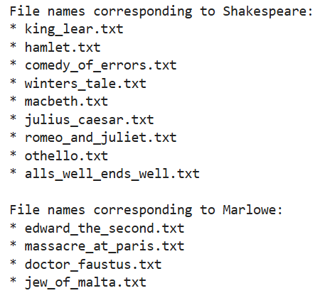
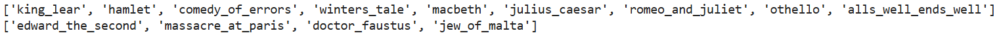
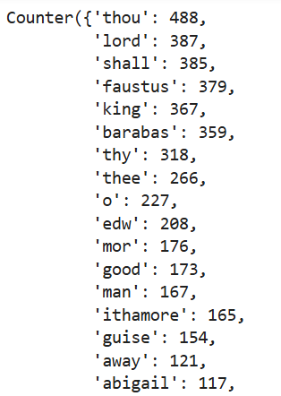
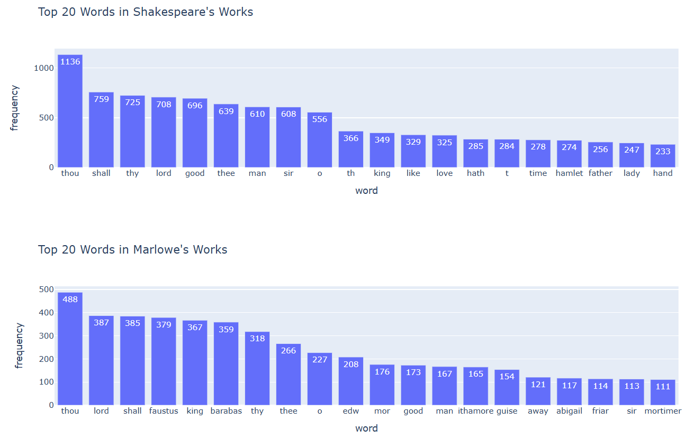

:::::::::::::::::::::::::::::::::::::: questions 

- What quantitative analysis operations can be performed on data composed of literary 
texts?
- How can these operations be translated into Python code?

::::::::::::::::::::::::::::::::::::::::::::::::

::::::::::::::::::::::::::::::::::::: objectives

- Learn how to perform word frequency analysis on literary texts. 
- Learn how to perform keyword-in-context analysis on literary texts.
- Learn how to perform collocation analysis on literary texts. 
- Learn how to measure lexical diversity in a literary canon.
::::::::::::::::::::::::::::::::::::::::::::::::

In the previous episode, we worked with tabular data and performed three
core operations often used in quantitative humanities research: *counting*, *searching*,
and *visualizing*. In this episode, we'll apply similar operations to text
data. We'll focus on analyzing the full texts of plays written by two 
prominent English playwrights from the 16th century: William Shakespeare (1564–1616) 
and Christopher Marlowe (1564–1593). We’ll learn how to perform the following types of
analysis on these texts using Python:

1. Word frequency analysis
2. Keyword-in-context analysis
3. Collocation analysis
4. Measuring lexical diversity


Because text fundamentally differs from tabular data, we’ll take a completely 
different approach in this episode compared to the previous one, using distinct 
Python libraries and syntax to carry out analytical tasks. 

To save the data locally on your computer, create a directory named
`data` in your working directory. Inside the `data` directory, create two
further directories named `marlowe` and `shakespeare`. Download the works by
each playwright from the GitHub links provided in the **Summary and
Setup** episode, and save them in the corresponding folders you’ve
just created.

In jupyter notebook, go ahead and save the path to each directory in a variable 
like this: 


``` python
shakespeare_path = './data/shakespeare'
marlowe_path = './data/marlowe'
```

## 1. Word Frequency Analysis

Word frequency analysis is a foundational method in computational literary studies that 
involves counting how often individual words appear in a text or a collection of texts.
By quantifying language in this way, scholars can identify patterns, emphases, and 
stylistic tendencies within texts.

Word frequency analysis can serve several purposes in literary research:

- It can reveal recurring themes or motifs by highlighting which words are most 
frequently used, offering insight into a text’s dominant concerns or rhetorical 
strategies. 
- It can also be used to compare the linguistic style of different authors, genres, or historical
periods, helping to map changes in diction, tone, or subject matter over time.
- In studies of individual works, frequency analysis can assist in tracking narrative
focus or character development by examining how often certain names, places,
or concepts appear across a text.
- Beyond individual texts, word frequency analysis can also support authorship attribution,
genre classification, and the study of intertextuality. 

We'll explore which words were
most frequently used in nine of Shakespeare’s plays and four of Marlowe’s,
all included in our dataset. This analysis will help us gain insight into
the themes and rhetoric of some of the most influential English plays written
in 16th-century England.

### Step 1: Loading the dataset into the script

Unlike the previous episode, where the dataset was stored in a single `.csv`
file, the dataset for this episode is stored in thirteen separate `.txt` files.
To store multiple texts in a single Python variable, we can construct
a *Python dictionary*.

We’re going to create two dictionaries: one for Marlowe’s plays, and one
for Shakespeare’s. The keys in each dictionary will be the names of the
`.txt` files — which correspond to the play titles — and the values will be the
full texts of the plays. First, let's build a list of keys for
each dictionary:

``` python
import os

shakespeare_files = [f for f in os.listdir(shakespeare_path)]
marlowe_files = [f for f in os.listdir(marlowe_path)]

print("File names corresponding to Shakespeare:")
for file in shakespeare_files: 
    print ("*", file)
print()
print("File names corresponding to Marlowe:")
for file in marlowe_files: 
    print ("*", file)
```



::::::::::::::::::::::::::::::::::::::: discussion
#### Let's analyze the code line by line

In the above code, we're defining two lists: `shakespeare_files` and `marlowe_files`.

:::::::::::::::::::::::::::::::::::::::::: spoiler
#### What is a Python list?

A list in Python is a type of data structure used to store multiple items in a 
single variable. Lists can hold different types of data like numbers, strings, 
or even other lists. Items in a list are ordered, changeable (mutable), 
and allow duplicate values- meaning that the same value can appear multiple times 
in the list without any issue. 

Python lists are enclosed in square brackets: **[ ]**. A Python list could look like this: 

```python
my_list = ['apples', 'oranges', 12, [4, 5, 6], 'bananas']
```
::::::::::::::::::::::::::::::::::::::::::::::::::

```
import os
```
This line imports Python’s built-in `os` module, which provides functions for 
interacting with the operating system. This includes functions to work with 
files and directories.

```
shakespeare_files = [f for f in os.listdir(shakespeare_path)]
marlowe_files = [f for f in os.listdir(marlowe_path)]
```
This is a list comprehension, which is a short way to create a new list using 
a `for` loop.

:::::::::::::::::::::::::::::::::::::::::: spoiler
#### What is a for loop?

A for loop is used in Python to repeat an action for every item in a group 
(like a list). You can think of it as a way to go through a collection of 
things one by one and do something with each item. Here’s a basic idea:

```
for item in group:
    do something with item
```

The loop takes one item from the group, does something with it, then moves on 
to the next, until there are no more items left.
::::::::::::::::::::::::::::::::::::::::::::::::::

- `os.listdir(shakespeare_path)` calls a function named `listdir()` from the 
`os` module. It takes the path to a directory (given in `shakespeare_path`) 
and returns a list of all the names of files and folders inside that directory.

- `for f in os.listdir(shakespeare_path)` is a `for` loop. It goes through each 
item in the list returned by `os.listdir(shakespeare_path)`. For each item 
(each filename), it temporarily gives it the name `f`. So, `f` is a variable 
that holds each filename one by one. 

- The list comprehension `[f for f in os.listdir(shakespeare_path)]` basically 
says: "Take each `f` (each filename) from the directory, and put it into a new list."
That new list is then assigned to the variable `shakespeare_files`.

`marlowe_files` is another list that is created through the exact same process. 

```
print("File names corresponding to Shakespeare:")
for file in shakespeare_files: 
    print ("*", file)
print()
print("File names corresponding to Marlowe:")
for file in marlowe_files: 
    print ("*", file)
```

Having created these lists, we proceed to print their items one by one, again 
using a `for` loop. Notice how the `for` loop is being implemented here as compared 
to the list comprehension above. Can you see the logic behind its syntax?

:::::::::::::::::::::::::::::::::::::::::::::::::::

In order to use the file names as dictionary keys, we need to get rid of their 
`.txt` extension. To do so, let's write a function that does exactly this for us. 
The function takes a list of file names, removes their `.txt` extensions, and 
returns a list of file names without extension:

``` python
def extention_remover (file_names):
    filenames_without_extention = [file.removesuffix(".txt") for file in file_names]
    return filenames_without_extention
```

Now let's apply the function to `shakespeare_files` and `marlowe_files` and store the 
results in two new lists, `shakespeare_works` and `marlowe_works`. We'll print the 
resulting lists to make sure that the file extensions have been successfully 
removed from them: 

``` python
shakespeare_works= extention_remover(shakespeare_files)
marlowe_works= extention_remover(marlowe_files)

print (shakespeare_works)
print (marlowe_works)
```



So far, so good! Now we can create dictionaries containing all the works
by each author. To do this, we'll define a function that handles it
for us. We'll also incorporate the earlier steps - specifically, reading file names
from a directory and applying the `extension_remover` function to strip their extensions.
This way, the new function can take the path to a folder containing
our literary works and return a dictionary where each file name (without the
extension) becomes a key, and the corresponding literary text becomes the value:

``` python
def literary_work_loader (path):
    
    def extention_remover (file_names):
        filenames_without_extention = [file.removesuffix(".txt") for file in file_names]
        return filenames_without_extention
        
    file_names= [f for f in os.listdir(path)]
    work_names= extention_remover (file_names)

    full_text_dict= {}
    
    for file, work in zip(file_names, work_names): 
        with open(f"{path}/{file}", "r", encoding="utf-8") as f:
            full_text = f.read().replace("\n", "")
            full_text_dict[work]= full_text
    
    return full_text_dict
```

::::::::::::::::::::::::::::::::::::::: discussion
#### Let's analyze the code line by line

The first few lines of the above code are already familiar to you. So let's only 
focus on the part where we are creating a dictionary:

``` 
full_text_dict= {}
```

In this line, we are creating an empty dictionary and assigning it to a variable named 
`full_text_dict`. 

``` 
for file, work in zip(file_names, work_names):
```

This line sets up a `for` loop. It lets us go through two lists — `file_names` 
and `work_names` — **at the same time**. The `zip()` function pairs up each 
file name (with the `.txt` extension) and its matching cleaned-up name 
(with no `.txt` extension). So for each step in the loop:

- `file` will be the full file name (like "hamlet.txt"), and
- `work` will be the name without the `.txt` part (like "hamlet").

```
with open(f"{path}/{file}", "r", encoding="utf-8") as f:
```

This line opens a file so that we can read its contents.

- `f"{path}/{file}"` is an f-string that builds the complete path to the file. 

:::::::::::::::::::::::::::::::::::::::::: spoiler
#### What is an f-string?

An *f-string* (short for *formatted string*) is a 
way to create strings that include variables inside them. It makes it easier to 
combine text and values without having to use complicated syntax.
Here's the basic idea:

``` 
name = "Bani"
greeting = f"Hello, {name}!"
print(greeting)
```

Output: `Hello, Bani!`

The `f` before the opening quotation mark tells Python: This is a formatted string.
Inside the string, you can use curly braces { } to include variables (like `name`) 
or even expressions (like `1 + 2`).
::::::::::::::::::::::::::::::::::::::::::::::::::

<div style="margin-left: 30px;">
If `path` equals "./data/shakespeare" and `file` equals "hamlet.txt", this becomes 
"./data/shakespeare/hamlet.txt".  
</div>

- `"r"` means we are opening the file in *read* mode (we are not changing it).
- `encoding="utf-8"` makes sure we can read special characters (like letters 
with accents).
- `as f` gives the file a nickname: `f`, so we can use it in the next line.
- The `with` keyword automatically closes the file when we're done reading it, 
which is a good habit.

```
full_text = f.read().replace("\n", "")
```

- `f.read()` reads the entire content of the file and stores it in a variable 
called `full_text`.
- `.replace("\n", "")` removes all the newline characters (`\n`) from the text by 
replacing them with a string with zero length, containing no characters (""). 
Normally, text files have line breaks. This line of code removes the line breaks 
and puts everything together in one big line of text.

```
full_text_dict[work] = full_text
```

This line adds a new entry to the `full_text_dict` dictionary.

- `work` is used as the key — that’s the cleaned-up name like "hamlet".
- `full_text` is used as the value — that’s the complete content of the file `hamlet.txt`.

```
return full_text_dict
```

This line returns the dictionary we built. Whoever uses this function will get 
back a dictionary with all the file names (without `.txt`) as keys and their full 
texts as values.

:::::::::::::::::::::::::::::::::::::::::::::::::::

Now that we have the function, we can use it to create two dictionaries 
containing the works of Shakespeare and Marlowe: 

``` python
shakespeare_texts= literary_work_loader (shakespeare_path)
marlowe_texts= literary_work_loader (marlowe_path)
```

Try printing the `marlowe_texts` dictionary, which is shorter, to get an overview 
of its structure and content. 

<span style="color:red">WE WERE HERE </span>

### Step 2: Performing Word Frequency Analysis using spaCy

Performing word frequency analysis is faster and easier than you think. This has
become possible thanks to *pretrained machine learning models* that the Python 
library `spaCy` offers. 

:::::::::::::::::::::::::::::::::::::::::: spoiler
#### What is a pretrained machine learning model?

A pretrained machine learning model is a model that has already been trained on
a large dataset by other developers or researchers. Instead of starting from scratch,
you can use this model to perform tasks like image recognition, language processing,
or object detection. It has already learned patterns and features from the data,
so you don’t need to teach it everything again. This saves time, computing resources,
and often improves accuracy, especially when you don’t have a lot of your
own data to train a model from the beginning. You can also fine-tune it
to work better on your specific task by giving it a smaller
set of relevant data. 
::::::::::::::::::::::::::::::::::::::::::::::::::

We are going to use `spaCy`'s `en_core_web_md` model for this exercise. You can 
directly download the model from your jupyter notebook by running the following
code: 

``` python
! python -m spacy download en_core_web_md
```

Once you have downloaded the `en_core_web_md` model, it stays on your computer so 
that you don't have to download it the next time you run the following lines of code
in jupyter notebook. 

Now we are going to write a function that takes the full text of each play, tokenizes
it, and then counts the number of times each word appears in that text. 

:::::::::::::::::::::::::::::::::::::::::: spoiler
#### What does tokenizing mean?

Tokenizing a text means breaking a piece of text into smaller parts - usually words, 
subwords, or sentences - so that a computer can work with it more easily.

In natural language processing (NLP), tokenization is often the first 
step when preparing text for most analysis tasks like word frequency analysis, 
language modeling, translation, or sentiment analysis.

The following example demonstrates how a sentence can be tokenized: 

```
text = "I love Python programming."
tokens = ['I', 'love', 'Python', 'programming']
```

In this case, each word is a token. However, more advanced tokenizers 
(like those in NLTK, spaCy, or transformers) can handle punctuation, subwords, 
and special characters more intelligently.

Tokenization is important in NLP because computers don’t understand raw text.
::::::::::::::::::::::::::::::::::::::::::::::::::

``` python
import spacy
from collections import Counter

def token_count(text):
    nlp = spacy.load("en_core_web_md")
    doc = nlp(text)
    
    words = [
        token.lemma_.lower()
        for token in doc
        if token.is_alpha               # Keep alphabetic tokens only
        and not token.is_stop           # Exclude stop words
        and token.pos_ != "VERB"        # Exclude verbs
    ]
    
    return Counter(words)
```

::::::::::::::::::::::::::::::::::::: challenge
Work with a partner and try to interpret the code above. Answer the following 
questions:

1. What do the imported libraries do? 
2. What does the function do?
3. Can you recognize the list comprehension in the function? How is is structured?
4. What Python object does the function return? What shape could it possibly have?

:::: solution
Let's analyze the code line by line and answer the above questions: 

1. `spacy` is a library that helps Python understand and work with natural language 
or human language (text). It can tokenize text, recognize parts of speech 
(like nouns or verbs), and more. `Counter` is a class from the `collections` module. 
It creates special dictionary-like objects that automatically count how often 
each item appears in a list.

2. The function `token_count` processes a string of text and returns a count of 
specific words, excluding common words and verbs. Let’s break down what happens, 
step by step:

<div style="margin-left: 30px;">

``` 
nlp = spacy.load("en_core_web_md")
```

- This line loads `en_core_web_md` — the pre-trained machine learning model from 
spaCy that we have already downloaded. This model has been trained on a large 
collection of English text and it can recognize words, their grammatical roles 
(like nouns or verbs), their base forms (lemmas), and more.
- We *instantiate* the `en_core_web_md` model, meaning that we load it using `spacy` 
and create an instance of it by assigning it to a variable named `nlp`. 
From now on, `nlp` represents this model in our code and it can be used to perform 
natural language processing on texts. 

``` 
doc = nlp(text)
```

Here, we use `nlp` to tokenize the text that is given to the `token_count` function 
as an argument. The result is a `Doc` object, stored in the variable `doc`. 
The `Doc` object represents the entire text and contains a sequence of Token 
objects. Each token is a word, punctuation mark, or other meaningful unit that 
the model has identified.

From there, the function filters and counts certain words from `doc`. 
We define which words these should be in the following list comprehension. 

</div>

3. 

<div style="margin-left: 30px;">

``` 
words = [
        token.lemma_.lower()
        for token in doc
        if token.is_alpha 
        and not token.is_stop 
        and token.pos_ != "VERB"
    ]
```

This list comprehension has the following structure: 

``` 
[token.lemma_.lower() for token in doc if ...]
```

It means:

- Go through each word (`token`) in the text (`doc`),
- Convert it to its lemma (basic form, like “run” instead of “running”),
- Make it lowercase,
- But only include it if it’s a word (no punctuation), not a stop word, 
and not a verb.

Stop words are very common words in a language — like "the", "and", "is", "in", 
or "of". These words are important for grammar, but they usually don’t carry much 
meaning on their own. In natural language processing, we often remove stop words 
because:

- They appear very frequently, so they dominate word counts.
- They don’t help us understand what the text is about.
- They’re similar across texts, so they’re not useful for comparing different documents.

We are also excluding verbs because, in performing this concrete word frequency 
analysis on the text of Marlowe and Shakespeare, we are more interested in nouns 
and adjectives, not in verbs. 

</div>

4. 

<div style="margin-left: 30px;">

The function returns a `Counter` object. This is like a dictionary where:

- Each key is a word,
- Each value is the number of times that word appeared.

So the shape is something like:

``` 
{'word1': 3, 'word2': 1, 'word3': 2}
```

</div>
::::
:::::::::::::::::::::::::::::::::::::::::::::::::

We are now only one step away from reaching the word frequencies in the entire text 
collections by Marlowe and Shakespeare. Whereas the `token_count` function only counts
words in a single text file, we have dictionaries that contain multiple
text files: four texts by Marlowe and nine by Shakespeare. So we need a further 
function that takes a dictionary — and not a single text file — and counts the 
words in all of the texts that exist as the values of keys in that dictionary. 
This way, we can count words not in a single text, but in a collection of texts
written by a single author. 

Writing this new function is going to be relatively easy, because we are going
to integrate the `token_count` function within it, which does most of the job 
for us: 

``` python
def token_frequency_count (text_dict):
    
    def token_count(text):
        nlp = spacy.load("en_core_web_md")
        doc = nlp(text)
        words = [
            token.lemma_.lower()
            for token in doc
            if token.is_alpha 
            and not token.is_stop  
            and token.pos_ != "VERB"
        ]
        return Counter(words)

    total_counts = Counter()
    for key, value in text_dict.items(): 
        total_counts += token_count (value)

    return total_counts
```

::::::::::::::::::::::::::::::::::::::: discussion
#### Let's analyze the code's last lines

The `token_frequency_count` function contains the `token_count` function that 
we have written previously. After defining the `token_count` function, we are creating  
an empty `Counter` object (which has the structure of a Python dictionary) and 
assigning it to the variable `total_counts`. 

Then, we are iterating through the keys and values of the input dictionary, namely 
`text_dict`, using a for loop. The for loop does the following: 

- It treats each key-value pair as an `item`. 
- It goes to the first item using its key, and reads the value of that key, which 
is the full text of a play. 
- It uses the `token_count` function to create a `Counter` object containing all the 
desired words (`tokens`) from that text and adds that `Counter` object to `total_counts`. 
- Then it goes to the next item (key-value pair) in `text_dict` and performs the 
above operations again. It keeps counting words from every text in `text_dict` and adding
them to `total_counts` until it reaches the last item in text_dict. 

:::::::::::::::::::::::::::::::::::::::::::::::::::

Let's apply the token_frequency_count function to the dictionaries we have created 
from the Marlowe and Shakespeare texts and take a look at the frequency of words used in 
these texts: 

``` python
shakespeare_frequency = token_frequency_count (shakespeare_texts)
marlowe_frequency = token_frequency_count (marlowe_texts)

marlowe_frequency
```



The above output shows some of the most frequent words used by Christopher Marlowe
in the four plays by him that we are analyzing. You can also display the frequency 
of words used by Shakespeare and compare both results. 

:::::::::::::::: callout
#### Interpreting and comparing the results

As you can see, comparing the two results can be time-consuming and un-intuitive, since
they are not displayed next to each other in jupyter notebook. Therefore, in 
the next step, we are going to visualize these word frequencies to get a better
overview of the contents of the texts written by each playwright, as well as to 
compare their linguistic styles and literary themes. 
::::::::::::::::::

### Step 3: Visualizing word frequencies

We have already worked with the `plotly.express` module in the previous episode, where we 
visualized DataFrames. We are going to implement the same library in this episode
as well. Let's write a function that takes the `Counter` object containing a 
dictionary of word frequencies (`freq_dict`), the number of the most frequent words that should
appear in the graph (`top_n`), and the title of the graph (`title`) as attributes, and 
creates a bar chart of the frequency of the selected words within the Counter
object:

``` python
import plotly.express as px
import pandas as pd

def plot_frequencies_plotly(freq_dict, top_n, title):
    
    most_common = freq_dict.most_common(top_n)
    df = pd.DataFrame(most_common, columns=['word', 'frequency'])
    fig = px.bar(df, x='word', y='frequency', title=title, text='frequency')
    
    fig.show()
```

***


``` python
plot_frequencies_plotly(shakespeare_frequency, 20, "Top 20 Words in Shakespeare's Works")
plot_frequencies_plotly(marlowe_frequency, 20, "Top 20 Words in Marlowe's Worksthat")
```




<span style="color:red">WE ARE HERE </span>

::::::::::::::::::::::::::::::::::::: keypoints 
- Formulate appropriate quantitative research questions when working with 
data composed of literary texts.
- Learn about lists, for loops, and f-strings in Python.
- Get to know and use the Python library spaCy.
- Perform word frequency analysis using spaCy. 
- Perform collocation analysis using spaCy.
- Measure lexical diversity in a body of text. 
::::::::::::::::::::::::::::::::::::::::::::::::

