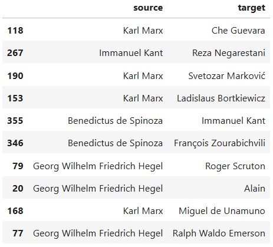
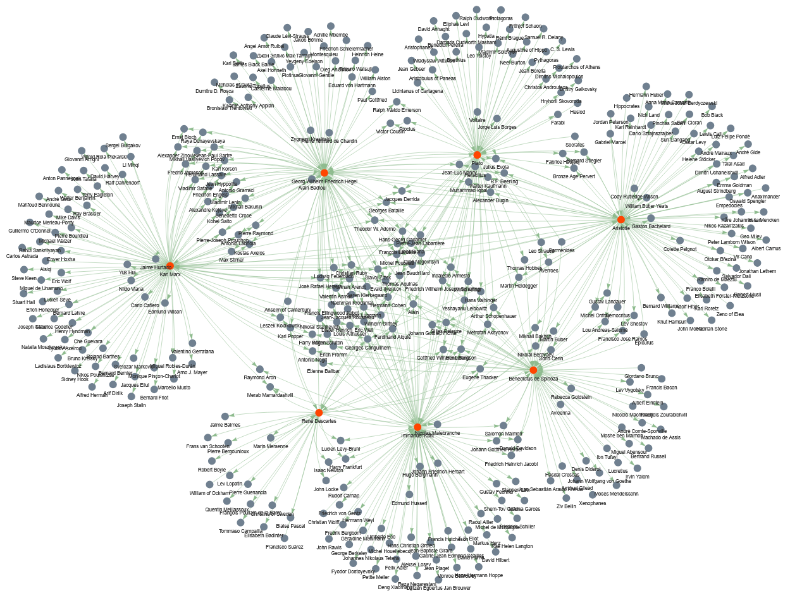

:::::::::::::::::::::::::::::::::::::: questions 
- What are networks in the sense that we mean in network analysis?
- What is the structure of a network like and what kind of data can be treated as network data?
- What is the difference between network analysis and network visualization?
- When is it meaningful to perform network anaylsis and network visualization?
::::::::::::::::::::::::::::::::::::::::::::::::


::::::::::::::::::::::::::::::::::::: objectives
- Learn the basics of network science and network analysis. 
- Learn about the structure of network data. 
- Learn to visualize networks. 
::::::::::::::::::::::::::::::::::::::::::::::::

## 1. Basics of Network Analysis

### What are Network Science and Network Analysis?

**Network Science** is an interdisciplinary field that studies complex networks, which are 
structures comprised of interconnected nodes (or vertices) and edges (or links). 
These networks can represent various real-world systems such as social networks 
(for example on social media), transportation networks, biological networks, 
and more. The aim of network science is to understand the topological structure of networks 
and the relationships that can be discovered within them.

**Network Analysis** refers to the methods and techniques used to study and evaluate 
networks. It involves identifying patterns, measuring node importance, analyzing connectivity, 
and understanding the underlying structure and function of the network. 

### When and With Which Type of Data is Network Analysis Useful?

Network analysis is particularly useful when the data can be represented as relationships or 
interactions between entities. Any type of data with this quality can be transformed into network
data. Network data is nothing but a tabular dataset with at least two columns: a `source` column and 
a `target` column. Each of these columns contains the names of the entities that are connected to 
each other in the network. Other columns can contain more information about the connection between
`source` and `target`, including the weight of this connection (identifying how strong it is) or its
type (for example, whether it is a connection between a human and a work of art, or one between 
two humans). 

In a visualized network, the sources and targets (usually represented by dots in the graph) are called
`nodes`, and the lines connecting them are called `edges`.

### Major Types of Networks

There are many different network types. Familiarity with them helps you decide in the future, 
when working with your own data, what network type your data can be converted to in order to optimally 
analyze its different features. 

Some important network types include: 

**1. Directed vs. Undirected Networks**

- Directed Networks: In these networks, the edges have a direction, indicating a one-way 
relationship between nodes. For example, in a citation network, if Paper A cites Paper B, 
the link goes from A to B but not necessarily in the reverse direction.

- Undirected Networks: Here, the edges do not have a direction, representing a symmetric 
relationship. An example would be a friendship network where two people are friends with 
each other, and the relationship is mutual.

**2. Weighted vs. Unweighted Networks**

- Weighted Networks: In weighted networks, edges have weights assigned to them, indicating 
the strength or capacity of the relationship. For instance, in a transportation network, 
the weights could represent distances or travel times.

- Unweighted Networks: These networks have edges that are simply present or absent, with no 
additional information about the strength of connections. An example is a simple social 
network where the only consideration is whether or not a connection exists.

**3. Bipartite Networks**

Bipartite networks consist of two distinct sets of nodes, and edges only connect nodes from 
different sets. An example is a movie recommendation system, where one set consists of users 
and the other set consists of movies.

**4. Homogeneous vs. Heterogeneous Networks**

- Homogeneous Networks: These networks consist of nodes of the same type. An example is a 
social network where all nodes represent people.

- Heterogeneous Networks: In these networks, nodes can represent different types of entities. 
For instance, a scientific citation network can include papers, authors, and journals as 
different types of nodes.

## 2. Visualizing Network Data

As mentioned above, network data is a specific form of tabular data. For the analyses in this lesson, 
I have extracted some network data from the website of 
[Wikidata](https://www.wikidata.org/wiki/Wikidata:Main_Page), using the programming language SPARQL. 
For this lesson, it is not necessary to understand how SPARQL works. 

The dataset is stored in a CSV file. It represents a table composed of two columns: `source` 
and `target`. Both columns contain names of mostly European personalities. This table was 
constructed to represent a directional network, meaning that the philosophers and thinkers that 
appear in the `source` column have influenced the work of those in the `target` column. 

To construct this dataset, I have searched Wikidata for people whose work has been influenced by
Karl Marx, Georg Wilhelm Friedrich Hegel, Immanuel Kant, Benedictus de Spinoza, René Descartes
Plato, Friedrich Nietzsche, or Aristotle, as well as those who have influenced the work of these
philosophers. Therefore, these seven personalities make up the most important nodes in the network. 

Let's read the data into Jupyter Notebook, convert it to a Pandas dataframe, and display a sample of 
that dataframe with ten rows: 

``` python
import pandas as pd

data_url='https://raw.githubusercontent.com/HERMES-DKZ/python_101_humanities/main/episodes/data/influence_network.csv'
influence_df = pd.read_csv(data_url)
influence_df.sample(10)
```



Now let's write some Python code that visualizes the network graph for us: 


``` python
import networkx as nx
from pyvis.network import Network

# Step 1: Build the NetworkX graph
G = nx.DiGraph()

# Add nodes
all_nodes = set(influence_df['source']).union(set(influence_df['target']))
G.add_nodes_from(all_nodes)

# Add edges
for _, row in influence_df.iterrows():
    G.add_edge(row['source'], row['target'])

# Step 2: Create a PyVis network
net = Network(directed=True, height='1000px', width='100%')

# Import the NetworkX graph
net.from_nx(G)

# Step 3: Apply your original visual styling

highlighted = {
    'Karl Marx',
    'Georg Wilhelm Friedrich Hegel',
    'Immanuel Kant',
    'Benedictus de Spinoza',
    'René Descartes',
    'Plato',
    'Friedrich Nietzsche',
    'Aristotle'
}

for node in net.nodes:
    if node['id'] in highlighted:
        node['color'] = 'orangered'
    else:
        node['color'] = 'slategrey'

for edge in net.edges:
    edge['color'] = 'darkseagreen'
    edge['arrows'] = 'to'

# Step 4: Save output
net.save_graph("influence_network.html")
print("FINISHED! Network saved as 'influence_network.html'.")
```



Don't worry if the network that you have visualized in your code doesn't look exactly like the one
displayed here. `Pyvis` creates interactive network graphs, so that you can pull the nodes around
with the mouse and change their constellation. 

::::::::::::::::::::::::::::::::::::::: discussion
#### Let's analyze the code's last lines

First, let's look at what is happening at each step: 

1. Build the `NetworkX` graph: Creates a directed graph `G`, collects unique node names from 
`influence_df`, and adds directed edges from source → target.
2. Create a `PyVis` network: Builds an interactive visualization object net (browser-friendly) 
and imports the `NetworkX` graph into it.
3. Apply visual styling: Colors a chosen set of important nodes (highlighted) differently, 
sets a color and arrow style for every edge.
4. Save output: Writes the interactive HTML file `influence_network.html` and prints a short 
completion message.

Now, let's look more deeply into what each code chunk does: 

```
import networkx as nx
from pyvis.network import Network
```
Imports the `NetworkX` library under the name `nx` — used for building and manipulating graphs.
Imports `Network` from `PyVis`, a class for creating interactive network visualizations that open 
in a browser.

```
# Step 1: Build the NetworkX graph
G = nx.DiGraph()
```
Creates an empty directed graph object `G` (edges have direction).

```
# Add nodes
all_nodes = set(influence_df['source']).union(set(influence_df['target']))
```
Collects all unique node names: takes the `source` column and `target` column from `influence_df`, 
converts each to a set, and unions them so each node appears once. 

```
G.add_nodes_from(all_nodes)
```
Adds every element of `all_nodes` as a node in the graph `G`.

```
# Add edges
for _, row in influence_df.iterrows():
    G.add_edge(row['source'], row['target'])
```
Loops over each row of `influence_df`. For each row, reads source and target and adds a directed 
edge from `source` to `target` in `G`. (_ ignores the row index returned by `iterrows()`.)

```
# Step 2: Create a PyVis network
net = Network(directed=True, height='1000px', width='100%')
```
Creates a `PyVis` Network instance `net`. `directed=True` ensures arrows are shown for direction; 
height/width set how big the visualization will appear in the browser.

```
# Import the NetworkX graph
net.from_nx(G)
```
Converts the `NetworkX` graph `G` into the `PyVis` object `net`, copying nodes and edges so `PyVis` 
can render them interactively.

```
# Step 3: Apply your original visual styling
highlighted = {
    'Karl Marx',
    'Georg Wilhelm Friedrich Hegel',
    'Immanuel Kant',
    'Benedictus de Spinoza',
    'René Descartes',
    'Plato',
    'Friedrich Nietzsche',
    'Aristotle'
}
```
Defines a Python `set` named `highlighted` containing node labels that should receive special visual 
styling (these are the seven featured philosophers mentioned earlier).

```
for node in net.nodes:
    if node['id'] in highlighted:
        node['color'] = 'orangered'
    else:
        node['color'] = 'slategrey'
```
Iterates each node in the `PyVis` representation. In `PyVis`, each item in `net.nodes` is a dictionary 
describing one visual node in the interactive network. It contains all the display attributes 
`PyVis` needs to render that node in the browser. Each dictionary represents one node in your network, 
including:
- the node’s internal ID (usually the label from the NetworkX graph)
- the text shown next to the node
- visual settings such as size, color, shape, and physics behavior

In each iteration, if the node's id (its label) is in `highlighted`, sets its color to 'orangered', 
otherwise sets it to 'slategrey'. This changes node appearance in the HTML output.

```
for edge in net.edges:
    edge['color'] = 'darkseagreen'
    edge['arrows'] = 'to'
```
Iterates every edge (each is a dictionary, similar to `net.nodes`). Sets the edge color to 
'darkseagreen' and ensures an arrowhead points from source to target by setting 'arrows' to 'to'.

```
# Step 4: Save output
net.save_graph("influence_network.html")
```
Writes the interactive visualization to the file `influence_network.html`. Opening that file in a 
browser shows the network with the applied styling.
:::::::::::::::::::::::::::::::::::::::::::::::::::


<span style="color:red">WE ARE HERE. </span>

:::::::::::::::::::::::::::::::::::::::: keypoints
- Understand the use cases of network analysis. 
- Visualize networks using the Python library Pyvis.

::::::::::::::::::::::::::::::::::::::::::::::::::


